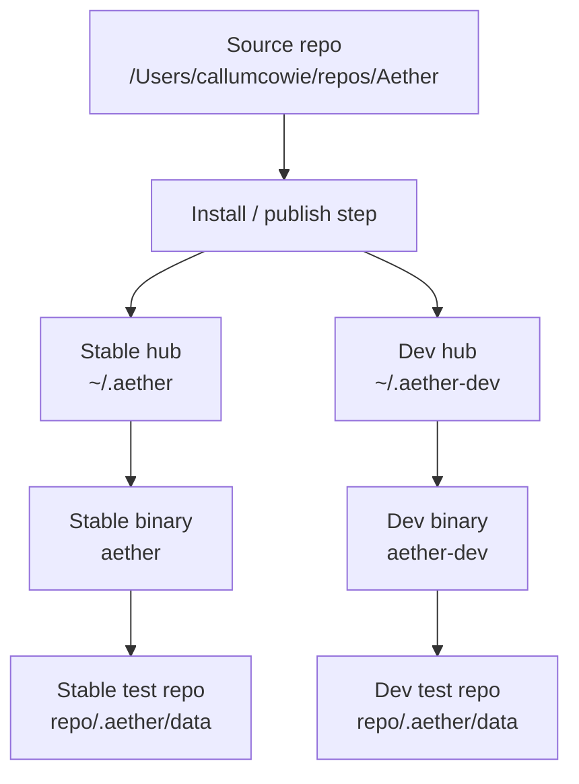
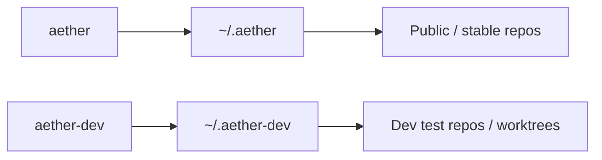
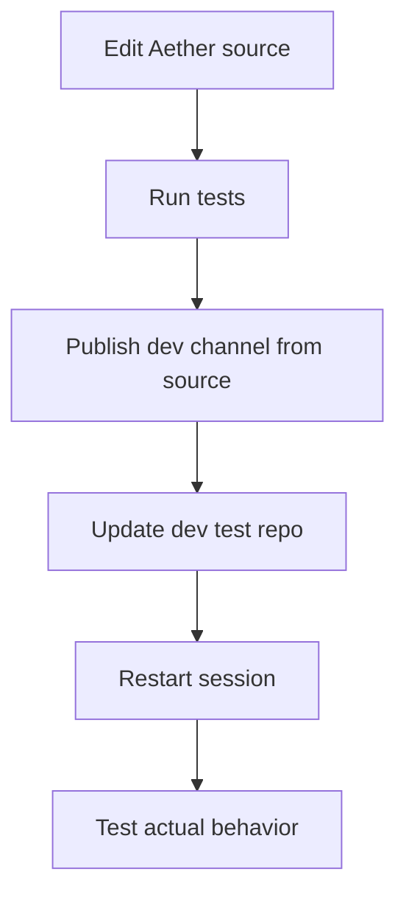
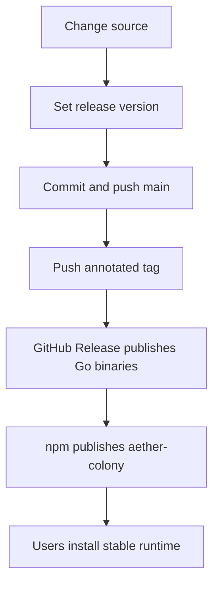

# **Aether Operations Guide**

*Printable operator sheet for developing, testing, publishing, and updating Aether safely.*

## **1. The One-Sentence Model**

**`aether` is the public/stable runtime. `aether-dev` is the isolated development runtime.**

The two things to remember are:

- **Global runtime state** lives in a **hub** under your home directory.
- **Repo colony state** lives inside each repo under **`.aether/`**.

> **Changing the channel changes the global runtime.**  
> **Changing the repo changes the local colony state.**

---

## **2. What Lives Where**



### **Global machine state**

**Stable**
- **binary:** `aether`
- **hub:** `~/.aether`

**Dev**
- **binary:** `aether-dev`
- **hub:** `~/.aether-dev`

### **Repo-local colony state**

Inside *every* target repo:

- `repo/.aether/data/`
- `repo/.aether/CONTEXT.md`
- `repo/.aether/HANDOFF.md`
- planning, survey, build, continue artifacts

### **Critical consequence**

**`aether-dev` gives you a clean global Aether. It does *not* automatically give you a clean repo colony.**

So:

- if you want to test **unreleased runtime changes**, `aether-dev` is enough for the **global** side
- if you want a **truly clean dev test**, use a **separate repo copy or worktree** as well

---

## **3. Stable vs Dev**



### **Use `aether` when**

- you want **public/stable behavior**
- you want to test what a real user should get
- you are using the **published** install/update path

### **Use `aether-dev` when**

- you changed the Aether source repo locally
- you want to test **unreleased** runtime or wrapper changes
- you do **not** want to overwrite the public/stable runtime on this machine

---

## **4. Best Practice**

This is the **correct operating model**:

1. **One codebase**
   - `/Users/callumcowie/repos/Aether`

2. **Two channels**
   - `aether` + `~/.aether`
   - `aether-dev` + `~/.aether-dev`

3. **Two kinds of test repo**
   - **stable repo/worktree**
   - **dev repo/worktree**

4. **npm stays stable-only**
   - `npx --yes aether-colony@latest` is for the **public** channel

5. **GitHub Releases stay stable-only**
   - release assets are the source of truth for the public runtime

### **Do not do this**

Do **not** compare stable and dev by flipping the **same repo copy** back and forth between:

```bash
aether update --force
aether-dev update --force
```

That works technically, but it is easy to confuse because the repo-local `.aether/data` remains the same colony history.

---

## **5. Daily Aether Development Workflow**

Use this when you are actively changing Aether itself.



### **Step A — Work in the source repo**

```bash
cd /Users/callumcowie/repos/Aether
```

### **Step B — Run tests**

```bash
go test ./... -count=1
```

### **Step C — Publish the dev channel from source**

```bash
go run ./cmd/aether publish --channel dev --binary-dest "/Users/callumcowie/repos/Aether-dev/bin"
```

> **Dev publish never touches `~/.aether` or `aether`.** This is enforced by runtime guards.
> If you accidentally try to publish dev to the stable hub, the command will refuse.

This does **all** of the following:

- rebuilds the **dev binary** as `aether-dev`
- refreshes the **dev hub** at `~/.aether-dev/`
- verifies binary and hub versions agree after publish
- leaves the public/stable runtime alone

> **Isolation guarantee:** See Section 11 (Safe Testing Matrix) for the complete
> separation rules. When testing dev changes, always use a **separate repo copy or worktree**
> in addition to the dev binary and hub.

> **Backward compatibility:** `aether install --package-dir "$PWD"` continues to work.
> `aether publish` is the recommended path because it is discoverable and includes
> automatic version agreement verification.

### **Step D — Update a dev test repo**

In the repo you want to test:

```bash
aether-dev update --force
```

### **Step E — Restart the session**

After install or update:

- close the current Claude/OpenCode/Codex session
- open a **fresh** session in that repo

**Why:** file changes on disk do not automatically refresh a live tool session.

### **Version Agreement Verification**

`aether publish` automatically checks that the binary version and hub version match after publishing. If they do not match, publish fails loudly with the mismatch details.

Flags:

| Flag | Description |
|------|-------------|
| `--package-dir` | Source directory (default: current directory) |
| `--home-dir` | User home directory (default: `$HOME`) |
| `--channel` | Runtime channel (`stable` or `dev`) |
| `--binary-dest` | Where to place the built binary |
| `--skip-build-binary` | Skip `go build`; use existing binary |

---

## **6. Version Verification**

Use `aether version --check` to manually verify that the binary version and hub version agree.

```bash
aether version --check
```

Exit codes:

- `0` — binary and hub versions agree
- non-zero — versions mismatch or hub is not installed

Example success:

```text
{"ok":true,"message":"Version check passed: binary and hub both at 1.0.20","version":"1.0.20"}
```

Example failure:

```text
Error: version mismatch: binary=1.0.20 hub=1.0.19
```

This is useful after publish or before reporting issues, to confirm the runtime is consistent.

### **Troubleshooting: publish fails with version mismatch**

If `aether publish` fails with a version mismatch error:

1. Check the binary version: `aether version`
2. Check the hub version: `cat ~/.aether/system/version.json`
3. Re-run publish from the source repo: `aether publish`

The mismatch means the hub was not updated to match the binary. Publish will fix this automatically on the next successful run.

---

## **7. Stable / Public Testing Workflow**

Use this when you want to test what an actual user gets.

### **If the repo already uses Aether**

```bash
aether update --force --download-binary
```

### **If the repo has never been set up**

```bash
aether lay-eggs
aether update --force --download-binary
```

### **Then**

- close the current session
- open a fresh session in that repo

### **Channel selection**

`aether update` infers the channel from the binary name (`aether` = stable, `aether-dev` = dev) or from the `AETHER_CHANNEL` environment variable. You can also override explicitly:

```bash
aether update --channel stable --force
aether update --channel dev --force
```

### **Stale publish detection**

Every `aether update` automatically checks whether the hub publish is fresh by comparing binary and hub versions and verifying companion-file completeness. Classifications:

| Classification | Meaning | Behavior |
|---|---|---|
| `ok` | Binary and hub versions agree, companion files complete | Update proceeds normally |
| `info` | Companion files are incomplete (counts below expected) | Update proceeds, warning displayed |
| `warning` | Hub version is ahead of binary version | Update proceeds, warning displayed |
| `critical` | Hub version is behind binary version (stale publish) | **Update blocked**, non-zero exit code |

When `critical` is detected, the command prints a recovery command:

```bash
# For stable
aether publish

# For dev
aether publish --channel dev
```

### **Rule**

Use a **stable repo copy/worktree** for this.
Do **not** use your dev test repo for public/stable verification.

---

## **8. Exact Release Workflow**



## **Release variables**

Choose the release version first:

```bash
VERSION="1.0.20"
```

## **Step 1 — Update the version in both places**

Edit these files so they both match **exactly**:

- `.aether/version.json`
- `npm/package.json`

## **Step 2 — Commit and push**

```bash
git add .aether/version.json npm/package.json
git commit -m "release: prepare v$VERSION"
git push origin main
```

## **Step 3 — Push the annotated release tag**

```bash
git tag -a "v$VERSION" -m "v$VERSION"
git push origin "v$VERSION"
```

## **Step 4 — Verify the GitHub release**

```bash
gh release view "v$VERSION"
```

If the release workflow did **not** trigger automatically, try:

```bash
gh workflow run Release -f tag="v$VERSION"
```

If GitHub still refuses to run it, use the documented manual fallback:

```bash
export GITHUB_TOKEN="$(gh auth token)"
goreleaser release --clean
```

## **Step 5 — Publish npm only after GitHub release assets exist**

First authenticate if needed:

```bash
npm login --registry=https://registry.npmjs.org/
npm whoami
```

Then publish:

```bash
cd /Users/callumcowie/repos/Aether/npm
npm publish --access public
```

## **Step 6 — Verify npm**

```bash
npm view aether-colony dist-tags --json
npm view aether-colony version
```

Expected:

- `latest` points to the same version as GitHub release `v$VERSION`
- package version matches `.aether/version.json`

---

## **9. Public Install Paths**

### **Go install**

```bash
go install github.com/calcosmic/Aether@latest
aether install
```

### **npm bootstrap**

```bash
npx --yes aether-colony@latest
```

### **Important**

**npm is a bootstrap/discovery path, not a second runtime.**  
It should always point to the same **stable** public release version.

---

## **10. Exact Verification Commands**

## **Source repo verification**

```bash
cd /Users/callumcowie/repos/Aether
go test ./... -count=1
go build ./cmd/aether
```

## **Stable hub verification**

```bash
find ~/.aether/system/commands/claude -maxdepth 1 -type f | wc -l
find ~/.aether/system/commands/opencode -maxdepth 1 -type f | wc -l
find ~/.aether/system/agents -maxdepth 1 -type f | wc -l
find ~/.aether/system/codex -maxdepth 1 -type f | wc -l
find ~/.aether/system/skills-codex -name SKILL.md | wc -l
```

## **Dev hub verification**

```bash
find ~/.aether-dev/system/commands/claude -maxdepth 1 -type f | wc -l
find ~/.aether-dev/system/commands/opencode -maxdepth 1 -type f | wc -l
find ~/.aether-dev/system/agents -maxdepth 1 -type f | wc -l
find ~/.aether-dev/system/codex -maxdepth 1 -type f | wc -l
find ~/.aether-dev/system/skills-codex -name SKILL.md | wc -l
```

Expected counts:

- **Claude commands:** `50`
- **OpenCode commands:** `50`
- **OpenCode agents:** `25`
- **Codex agents:** `25`
- **Codex skills:** `29`

---

## **11. Release Integrity Checks**

Use `aether integrity` to validate the full release pipeline chain — source version, binary version, hub version, companion files, and a downstream update simulation.

### **Auto-detection**

The command auto-detects whether you are in a source repo (the Aether repo itself) or a consumer repo (any repo using Aether):

- **Source repo** — runs 5 checks: source version, binary version, hub version, hub companion files, downstream simulation
- **Consumer repo** — runs 4 checks: binary version, hub version, hub companion files, downstream simulation

### **Flags**

| Flag | Description |
|------|-------------|
| `--json` | Output structured JSON instead of visual report |
| `--channel stable\|dev` | Override channel detection |
| `--source` | Force source-repo context (5 checks) |

### **Examples**

```bash
# In the Aether source repo
aether integrity

# In a consumer repo
aether integrity

# Force source-repo checks with JSON output
aether integrity --source --json

# Check dev channel
aether integrity --channel dev
```

### **The five checks**

1. **Source version** — reads `.aether/version.json` from the repo root
2. **Binary version** — reads the version from the running `aether` binary
3. **Hub version** — reads `~/.aether/system/version.json` (or `~/.aether-dev/` for dev)
4. **Hub companion files** — verifies expected file counts:
   - 50 Claude commands
   - 50 OpenCode commands
   - 25 OpenCode agents
   - 25 Codex agents
   - 29 Codex skills
5. **Downstream simulation** — runs stale publish detection (see Section 7)

### **Exit codes**

- `0` — all checks pass
- non-zero — one or more checks failed (see output for recovery commands)

### **Relationship to medic**

`aether medic --deep` includes integrity scanning automatically. Run `aether integrity` directly when you want a focused release-pipeline validation without the broader medic health checks.

---

## **12. Safe Testing Matrix**

| **What you are testing** | **Binary** | **Hub** | **Repo** |
|---|---|---|---|
| Public stable behavior | `aether` | `~/.aether` | stable repo/worktree |
| Unreleased source changes | `aether-dev` | `~/.aether-dev` | dev repo/worktree |
| Side-by-side comparison | both | both | two separate repo copies/worktrees |

---

## **13. Do / Don’t**

### **Do**

- **Do** use `aether-dev` for unreleased Aether development
- **Do** use `aether` for public/stable testing
- **Do** use separate repo copies/worktrees when comparing stable vs dev
- **Do** restart sessions after `install` or `update`
- **Do** keep `.aether/version.json` and `npm/package.json` identical for stable releases

### **Don’t**

- **Don’t** use npm as a second runtime
- **Don’t** compare stable vs dev in the same repo if you want a clean result
- **Don’t** assume changed files on disk means the live session is refreshed
- **Don’t** let source-development overwrite the stable/public runtime

---

## **14. Short Version**

```text
aether      = public / stable
aether-dev  = private development runtime

~/.aether      = stable global brain
~/.aether-dev  = dev global brain

repo/.aether/data = local colony state for that repo only
```

## **The two commands you will use most**

### **When developing Aether itself**

```bash
cd /Users/callumcowie/repos/Aether
aether publish --channel dev --binary-dest "/Users/callumcowie/repos/Aether-dev/bin"
```

> **Backward compatibility:** `go run ./cmd/aether install --channel dev --package-dir "$PWD" --binary-dest "..."` still works but `aether publish` is preferred because it includes automatic version agreement verification.

### **When testing those changes in a target repo**

```bash
aether-dev update --force
```
