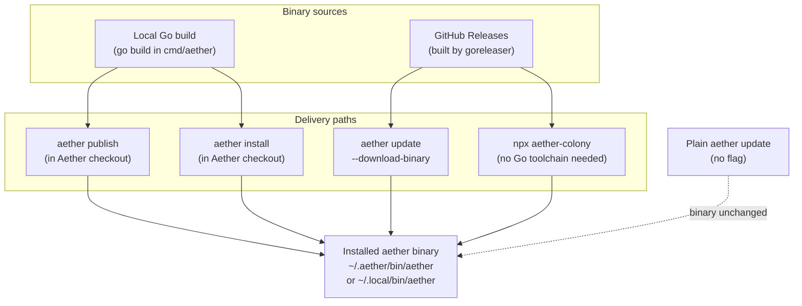
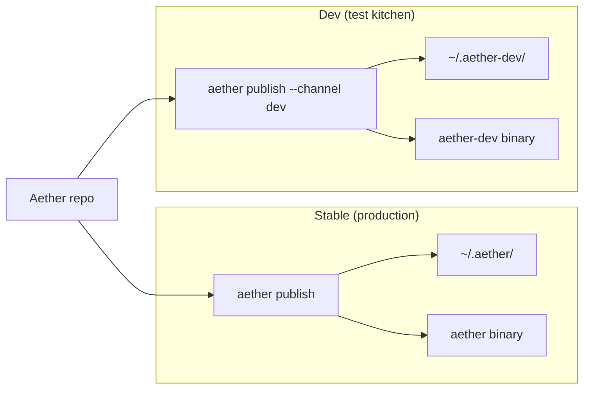
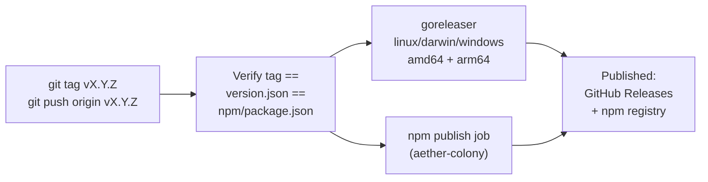

# Aether: The Updating Pipeline

> One-page map of how code moves from this repo to users' projects, and where the binary actually comes from.

---

## TL;DR

| Flow | Command | Direction | Touches binary? |
|------|---------|-----------|-----------------|
| **Publish** | `aether publish` (in this repo) | source checkout → hub | Yes (rebuilds from source) |
| **Update**  | `aether update` (in any repo)  | hub → downstream repo   | No (companion files only) |
| **Release** | `git tag vX.Y.Z && git push` | source → GitHub Releases → npm | Yes (cross-platform builds) |

Three commands, three directions, one shared hub at `~/.aether/` (stable) or `~/.aether-dev/` (dev).

---

## 1. The master diagram

This is the whole factory. Plain `aether update` only follows the solid green arrow — it never touches the binary. The dashed arrow is what `--download-binary` adds.

```mermaid
flowchart LR
    SRC["Aether repo<br/>cmd/, .aether/, wrappers"]
    HUB["Hub<br/>~/.aether/system/<br/>+ bin/aether<br/>+ version.json"]
    DOWN["Downstream repo<br/>.aether/ .claude/<br/>.opencode/ .codex/"]
    REL["GitHub Releases<br/>cross-platform binaries"]
    NPM["npm registry<br/>aether-colony bootstrap"]
    USER["End user<br/>(no Go toolchain)"]

    SRC -->|"aether publish"| HUB
    HUB -->|"aether update"| DOWN
    SRC -->|"git tag + goreleaser"| REL
    REL -->|"npm publish job"| NPM
    NPM -->|"npx aether-colony"| USER
    USER -->|"downloads binary,<br/>runs aether install"| HUB
    REL -.->|"aether update<br/>--download-binary"| HUB

    style SRC fill:#1a1a2e,color:#e0e0e0,stroke:#16213e
    style HUB fill:#0f3460,color:#e0e0e0,stroke:#16213e
    style DOWN fill:#2b6777,color:#e0e0e0,stroke:#16213e
    style REL fill:#533483,color:#e0e0e0,stroke:#16213e
    style NPM fill:#533483,color:#e0e0e0,stroke:#16213e
    style USER fill:#e94560,color:#fff,stroke:#16213e
```



**The hub is the middleman.** Every path — dev publishing, release downloads, npm bootstrap — eventually puts files in the same hub, and every downstream repo reads from it.

---

## 2. The three commands

| Command | Where you run it | What it actually does | Binary? |
|---------|------------------|------------------------|---------|
| `aether publish` | Aether source checkout | Builds binary, syncs companion files to hub, verifies binary version == hub version | Rebuilds from source |
| `aether install` | (a) Aether checkout, (b) anywhere via npm | (a) Legacy source-build path (see critique). (b) Materialises embedded assets from a released binary into the hub | Rebuilds from source (a), or already present (b) |
| `aether update` | Any downstream repo | Syncs hub → local repo (safe mode by default; `--force` overwrites + removes stale) | **No**, unless `--download-binary` |

### Sync pairs (`aether update`)

| From `~/.aether/system/` | To downstream repo | Contents |
|---|---|---|
| `.` | `.aether/` | skills, docs, templates, schemas, exchange, utils |
| `commands/claude/` | `.claude/commands/ant/` | 50 Claude slash commands |
| `agents-claude/` | `.claude/agents/ant/` | 25 Claude agent definitions |
| `commands/opencode/` | `.opencode/commands/ant/` | 50 OpenCode slash commands |
| `agents/` | `.opencode/agents/` | 25 OpenCode agent definitions |
| `codex/` | `.codex/agents/` | 25 Codex agent definitions (TOML) |
| `skills-codex/` | `.codex/skills/aether/` | 29 Codex skill files |
| `rules/` | `.claude/rules/` | Coding rules |
| `settings/claude/` | `.claude/settings.json` | Hook configuration |

**Protected paths** (never overwritten): `.aether/data/`, `.aether/dreams/`, `.aether/checkpoints/`, `.aether/locks/`, `QUEEN.md`, `CROWNED-ANTHILL.md`.

---

## 3. Where a binary actually comes from

This is the part that caused the "binary unchanged by aether update" confusion. There are **four** ways a binary reaches a machine, and only some of them are triggered by `aether update`.



**Plain `aether update` is deliberately the dashed line.** The message at [cmd/update_cmd.go](cmd/update_cmd.go) line 245 tells users exactly this:

> "The installed aether binary is unchanged — `aether update` only syncs repo companion files, not the shared binary. Run `aether publish` in the Aether repo to update the binary."

Before the recent fix, the message pointed people at `aether install --package-dir "$PWD"`, which is the legacy phrasing — it worked, but it wasn't the preferred command any more.

---

## 4. Dev vs stable channel

Two parallel installations so you can test without polluting the production runtime.



| Aspect | Stable | Dev |
|---|---|---|
| Binary name | `aether` | `aether-dev` |
| Hub | `~/.aether/` | `~/.aether-dev/` |
| Syncs to `~/.claude`, `~/.opencode`, `~/.codex`? | Yes | No |
| npm + GitHub Releases? | Yes | No |

Channel isolation is enforced in [cmd/publish_cmd.go](cmd/publish_cmd.go) via `validateChannelIsolation` — a dev publish into a stable hub (or vice versa) fails fast rather than silently corrupting state.

---

## 5. The release pipeline

Tag a version, GitHub does the rest.



Version agreement is a release-gate: [.github/workflows/release.yml](.github/workflows/release.yml) line 85-91 bails out if the three version strings disagree, so you can't ship mismatched artifacts.

---

## 6. Chicken-and-egg: bootstrapping logic changes

If you edit `install_cmd.go` or `publish_cmd.go` themselves, your currently-installed binary still has the **old** logic. Running `aether publish` would apply the old publish logic, not the new one.

**Escape hatch:** bootstrap once from source with `go run`, which compiles + runs the new logic in one shot without needing a pre-built binary:

```bash
go run ./cmd/aether publish
# or, legacy:
go run ./cmd/aether install --package-dir "$PWD" --binary-dest "$HOME/.local/bin"
```

After that one bootstrap, the freshly-built binary has the new logic and normal `aether publish` works again.

This is also why the release workflow re-checks out the tag from a clean slate ([.github/workflows/release.yml](.github/workflows/release.yml) line 69-73) rather than reusing whatever binary happens to be on the runner.

---

## 7. What can trip you up (critique)

Five friction points worth naming:

1. **`install` and `publish` overlap.** Both build-from-source when run in the Aether checkout. [cmd/publish_cmd.go](cmd/publish_cmd.go) line 17-20 literally says publish "replaces the ad-hoc `aether install --package-dir \"$PWD\"` pattern," yet `install` still does the same job and is referenced in lots of docs, skills, and the npm bootstrap. Two valid commands for the same action = decision fatigue and stale docs.

2. **Four paths to a binary.** `publish`, `install`, `update --download-binary`, and `npx aether-colony` all deposit a binary at the same slot. Plain `aether update` deliberately does **not** — which is why the "binary unchanged" message exists. If a user hasn't internalised the four-path mental model, that message reads like an error; it's actually a promise.

3. **Packaging mirrors can drift.** [embedded_assets.go](embedded_assets.go) embeds `.aether/agents-claude/` and `.aether/agents-codex/` into the binary. Those are byte-identical mirrors of `.claude/agents/ant/` and `.codex/agents/`. Edit the canonical location and forget the mirror, and the next `goreleaser` build ships stale embedded assets that nobody notices until `aether install` (without `--package-dir`) produces wrong agents.

4. **Stale publish detection is only visible when broken.** Every `aether update` runs `checkStalePublish` ([cmd/update_cmd.go](cmd/update_cmd.go) line 107, 164). In the OK case users see nothing; in the critical case the command errors out. Users therefore never build a mental model of what's being guarded — the detection is invisible until the day it saves you, and by then the error message has to do all the education.

5. **The `--force` flag is the only way to remove stale files.** Plain `aether update` is safe (new files only, never overwrites, never removes). This is friendly for day-one users but means a long-running repo accumulates orphaned files from renames/deletions in the source. The `--force` flag is the cleaner, but it's also the flag that overwrites local edits — so it's both the "clean house" and "lose my changes" switch rolled into one.

---

## 8. Your dev workflow in four steps

1. Edit files in this repo (Go, wrappers, `.aether/` content).
2. `aether publish --channel dev` + in a test repo `aether-dev update --force` to verify.
3. Commit, push, merge.
4. `git tag vX.Y.Z && git push origin vX.Y.Z` — GitHub builds binaries, publishes to npm.

---

## 9. Further reading

- [RUNTIME UPDATE ARCHITECTURE.md](RUNTIME%20UPDATE%20ARCHITECTURE.md) — reference-style runbook with full sync-pair tables and protected-path rationale.
- [AETHER-OPERATIONS-GUIDE.md](AETHER-OPERATIONS-GUIDE.md) — day-to-day operational commands.
- [cmd/publish_cmd.go](cmd/publish_cmd.go), [cmd/install_cmd.go](cmd/install_cmd.go), [cmd/update_cmd.go](cmd/update_cmd.go) — source of truth for behaviour.
- [.github/workflows/release.yml](.github/workflows/release.yml) + [.goreleaser.yml](.goreleaser.yml) — release automation.
- [npm/lib/bootstrap.js](npm/lib/bootstrap.js) — the `npx aether-colony` bootstrap logic.
