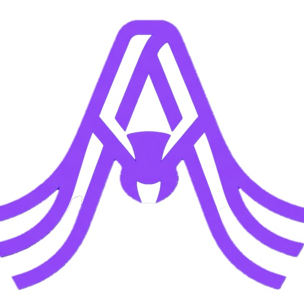
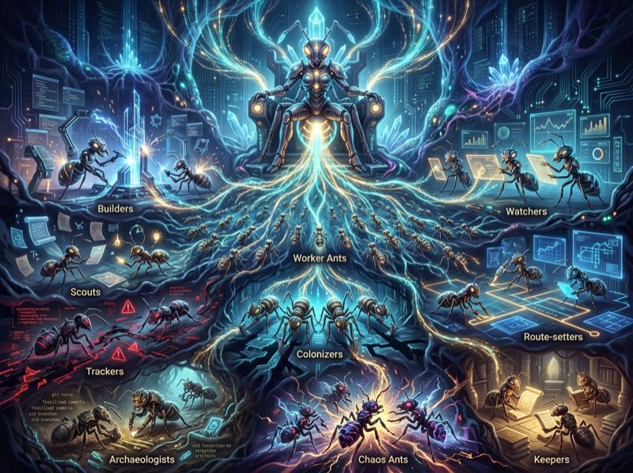
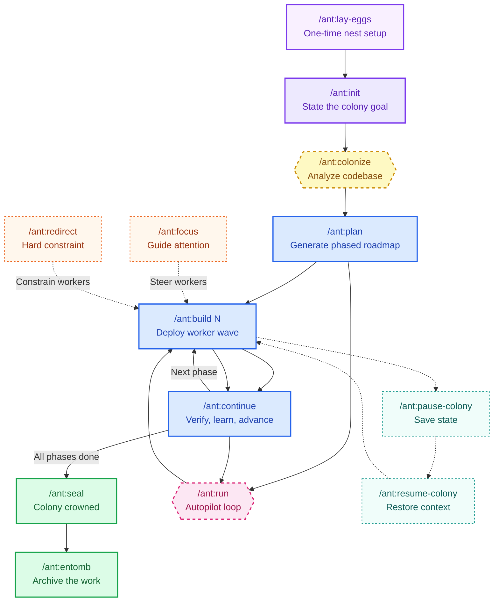
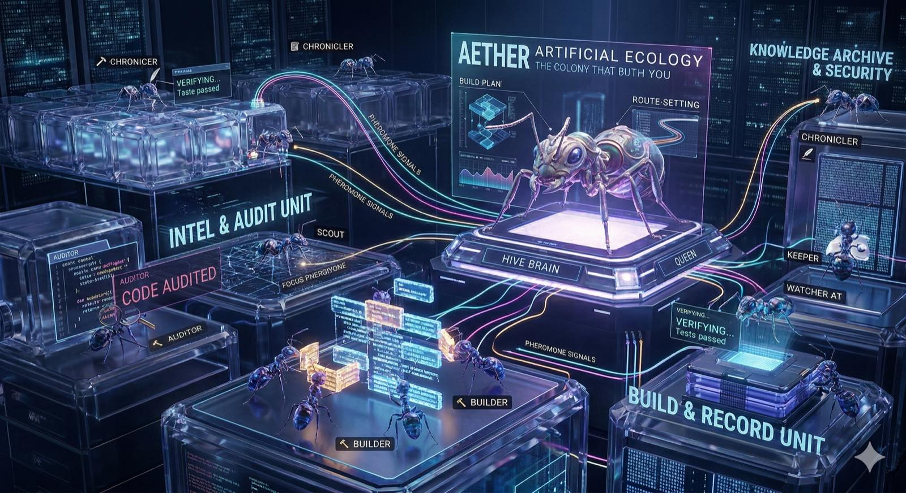

<div align="center">




# Aether

**Stop herding cats. Start a colony.**

Aether is an open-source biomimetic AI colony that replaces deterministic agent frameworks with a self-organizing swarm. Instead of brittle DAGs where one failure crashes everything, 24 specialized worker castes communicate through stigmergy — leaving plain-English Pheromone Signals (FOCUS, REDIRECT, FEEDBACK) that let the colony dynamically pivot without catastrophic failure. A built-in OODA loop treats errors as observations, not crashes, and a "Synthetic SLA" verification loop mathematically drives reliability from ~80% model accuracy to 99.2%. The Hive Brain ensures knowledge compounds across sessions and projects — instincts extracted from real work are scored for trust, promoted to permanent memory, and shared colony-wide. The result: complex intelligence emerges from simple, localized rules, just like a real ant colony.

<br>

[](https://github.com/calcosmic/Aether/releases)
[](LICENSE)
[](https://github.com/calcosmic/Aether/stargazers)
[](https://github.com/sponsors/calcosmic?utm_source=github&utm_medium=readme&utm_campaign=aether)

[](https://goreportcard.com/report/github.com/calcosmic/Aether)

[](https://pkg.go.dev/github.com/calcosmic/Aether)

[](https://github.com/calcosmic/Aether#key-features)
[](https://github.com/calcosmic/Aether#command-reference)
[](https://github.com/calcosmic/Aether/releases)

<br>

*The whole is greater than the sum of its ants.*

<br>

[](https://aetherantcolony.com?utm_source=github&utm_medium=readme&utm_campaign=aether)

<br>

https://github.com/calcosmic/Aether/releases/download/v1.0.1/The_Power_of_Absolute_Constraint.mp4

</div>

---

## 🐜 Why Aether

Every AI coding tool now has "agents." Most of them are the same thing repackaged — a loop that plans, executes, and checks. LangGraph uses strict directed state machines (DAGs). CrewAI uses top-down hierarchical delegation. AutoGen uses conversational group chats. That's not a colony. That's one ant doing laps.

Aether rejects all of these. It's an **Artificial Ecology** modeled on how real ant colonies work: no central brain, no single point of failure, no brittle JSON schemas. Instead, 24 specialized workers self-organize in parallel waves around your goal.

### Not Prompt Engineering — Stigmergy

Other approaches force LLMs to output and parse complex JSON schemas. One hallucinated bracket crashes the system. Aether abandons this entirely in favor of biological **stigmergy** — agents communicate indirectly by leaving plain-English Pheromone Signals (FOCUS, REDIRECT, FEEDBACK) in the environment. This "soft logic" steers the colony without catastrophic failures when unexpected edge cases arise.

### The Synthetic SLA: Trading Tokens for Certainty

Standard approaches treat an LLM failure as a fatal exception. Aether acknowledges that no single inference is 100% accurate and wraps the colony in a **System of Inference**: a Watcher and Critic verify a Builder's output in a best-of-n loop. With a Best-of-3 consensus, system reliability jumps from ~80% model accuracy to **99.2%**. Aether intentionally burns more compute tokens to guarantee deterministic-grade certainty.

### Platform-Enforced Discipline

Other tools give agents a system prompt but let them access every tool. Aether physically removes capabilities to force discipline:

- The **Auditor** and **Gatekeeper** have Write, Edit, and Bash tools **platform-revoked** — they cannot run commands or fix bugs, forcing purely static analysis
- The **Tracker** (bug hunter) is forbidden from modifying files so it never contaminates the "crime scene"

### Memory That Compounds

The biggest flaw in standard AI tools: close the session, lose everything. Aether's **Colony Wisdom Pipeline** solves this permanently:

1. Agents log **observations** as they work
2. Observations are deduplicated and scored for trust by the Nurse agent
3. High-confidence observations are promoted into permanent **instincts**
4. Instincts are encoded into **QUEEN.md** by the Herald agent
5. Cross-project wisdom flows to the global **Hive Brain**

The colony genuinely gets smarter the more you use it — across sessions and across completely different projects.

---

<p align="center">
  
</p>

---

## 📦 Install

**Option 1: Go binary (recommended)**

```bash
go install github.com/calcosmic/Aether@latest
```

Requires [Go 1.22+](https://go.dev/dl/).

**Option 2: Download from GitHub Releases**

Pre-built binaries for all platforms — no Go toolchain needed.

| Platform | Architecture | Download |
|----------|-------------|----------|
| Linux | amd64, arm64 | [Latest release](https://github.com/calcosmic/Aether/releases?utm_source=github&utm_medium=readme&utm_campaign=aether) |
| macOS | amd64, arm64 (Apple Silicon) | [Latest release](https://github.com/calcosmic/Aether/releases?utm_source=github&utm_medium=readme&utm_campaign=aether) |
| Windows | amd64, arm64 | [Latest release](https://github.com/calcosmic/Aether/releases?utm_source=github&utm_medium=readme&utm_campaign=aether) |

Built with [GoReleaser](https://goreleaser.com).

**Option 3: Companion files (npm)**

```bash
npm install -g aether-colony
```

> **Note:** This installs companion/template files only — it does **not** include the Aether binary. Install the binary first (Option 1 or 2), then use `aether setup` to sync companion files.

### ⚡ Quick start after install

```bash
aether install            # Populate the colony hub
aether setup             # Sync companion files to local repo

# Ignite the colony swarm
/ant:lay-eggs            # One-time nest setup
/ant:init "Build X"      # State the colony goal
/ant:plan                # Generate phased roadmap
/ant:build 1             # Deploy worker wave to phase one
/ant:continue            # Verify, learn, advance
/ant:seal                # Colony crowned — archive the work
```

Five commands from zero to shipped.

## ✨ Key Features

| | Feature | Description |
|---|---------|-------------|
| **Agents** | 24 Specialized Workers | Builder, Watcher, Scout, Tracker, Archaeologist, Oracle, and more |
| **Commands** | 45 Slash Commands | Full lifecycle for Claude Code and OpenCode |
| **Signals** | Pheromone System | FOCUS, REDIRECT, FEEDBACK — guide colony attention |
| **Memory** | Colony Wisdom | Learnings and instincts persist via QUEEN.md |
| **Hive Brain** | Cross-colony | Domain-scoped wisdom sharing |
| **Autopilot** | `/ant:run` | Build-verify-advance loop with smart pause |
| **Skills** | 28 Skills | 10 colony + 18 domain knowledge for workers |
| **Research** | Oracle + Scouts | Deep autonomous research before task decomposition |
| **Quality Gates** | 6-phase verification before advancing |
| **Platforms** | Claude Code + OpenCode | Binary + agent support |

### 🐜 Worker Castes

| | Caste | Role |
|---|-------|------|
| 👑🐜 | **Queen** | Colony coordinator — orchestrates goals, manages phase progression, curates wisdom |
| 🔨🐜 | **Builder** | Implementation work — writes code following TDD discipline |
| 👁️🐜 | **Watcher** | Monitoring and verification — quality checks and independent testing |
| 🔍🐜 | **Scout** | Research and discovery — investigates unfamiliar territory |
| 🗺️🐜 | **Colonizer** | New project setup — explores and maps existing codebases |
| 📊🐜 | **Surveyor** | Measurement and assessment — evaluates colony health and progress |
| 🎲🐜 | **Chaos** | Edge case testing — resilience and stress testing |
| 🏺🐜 | **Archaeologist** | Git history excavation — uncovers context from commit history |
| 🔮🐜 | **Oracle** | Deep research — autonomous research via RALF loop |
| 📋🐜 | **Route Setter** | Direction setting — defines phase plans and task decomposition |
| 🔌🐜 | **Ambassador** | Third-party API integration — bridges external services |
| 👥🐜 | **Auditor** | Code review and quality audits — includes security audit duties |
| 📝🐜 | **Chronicler** | Documentation generation — produces docs, READMEs, and guides |
| 📦🐜 | **Gatekeeper** | Dependency management — handles packages, versions, and supply chain |
| ♿🐜 | **Includer** | Accessibility audits — WCAG compliance and barrier identification |
| 📚🐜 | **Keeper** | Knowledge curation — manages instincts, patterns, and wisdom |
| ⚡🐜 | **Measurer** | Performance profiling — benchmarks and optimization |
| 🧪🐜 | **Probe** | Test generation — writes and maintains test suites |
| 🐛🐜 | **Tracker** | Bug investigation — traces, hunts, and roots out bugs |
| 🔄🐜 | **Weaver** | Code refactoring — restructures and cleans codebases |
| 💭🐜 | **Dreamer** | Creative ideation — imaginative exploration and blue-sky thinking |

## ⚖️ Aether vs Others

| Dimension | Aether | CrewAI | AutoGen | LangGraph |
|-----------|--------|--------|---------|-----------|
| **Language** | Go | Python | Python | Python |
| **License** | Apache 2.0 | MIT | MIT | Open + paid tiers |
| **Architecture** | Biological colony — 24 specialized workers self-organize via pheromone signals | Role-based agents with sequential/task delegation | Multi-agent conversation framework (Microsoft) | Graph-based state machines with conditional edges |
| **Memory / Learning** | Colony Wisdom — learnings persist as instincts, promote to QUEEN.md, share cross-colony via Hive Brain | Short-term memory + optional long-term via integration | No built-in persistent memory | Checkpoint-based state persistence |
| **Agent Coordination** | Pheromone signals (FOCUS, REDIRECT, FEEDBACK) guide attention without rewriting prompts | Hierarchical task delegation between role-assigned agents | Turn-based conversation between agents | Explicit graph edges define control flow |
| **Workers / Agents** | 24 specialized castes (Builder, Watcher, Scout, Tracker, Oracle, Archaeologist, etc.) | User-defined roles with goals and backstories | Configurable assistant and user proxy agents | Nodes as functions or LangChain runnables |
| **Commands / Control** | 45 slash commands across full lifecycle | Python SDK calls | Programmatic API | Python SDK + LangGraph Studio |
| **Autopilot** | `/ant:run` — automated build-verify-advance loop with smart pause | Sequential task execution, no built-in loop | No built-in loop | Can loop via graph cycles, not opinionated |
| **Quality Gates** | 6-phase verification before advancing phases | Optional human-in-the-loop review | No built-in gates | Manual checkpoint implementation |
| **Research** | Oracle + Scouts — autonomous deep research before task decomposition | No dedicated research agents | Group chat can approximate research | No built-in research pattern |
| **Platform Support** | Claude Code, OpenCode (binary + agent definitions) | Any Python environment | Any Python environment | Any Python environment |

## 🏗️ Architecture

```
.aether/                        Colony files (repo-local)
├── commands/                   45 YAML command sources
├── agents-claude/               Claude agent definitions
├── skills/                     28 skills (10 colony + 18 domain)
├── exchange/                   XML exchange modules
├── docs/                       Documentation
├── templates/                  12 templates
└── data/                       Colony state (local only)

~/.aether/                     Hub (cross-colony, user-level)
├── system/                   Companion file source (populated by install)
├── QUEEN.md                 Wisdom + preferences
├── hive/wisdom.json         Cross-colony wisdom (200 cap)
```

**Runtime:** Go 1.22+  
**Distribution:** GoReleaser (Linux, macOS, Windows / amd64 + arm64)

  
**Package:** `aether-colony` on npm (companion files only)

### 🔄 Colony Lifecycle



<div align="center">
<i>Five commands from zero to shipped. Workers self-organize around your goal.</i>
</div>

## 📡 Pheromone System

Every ant colony communicates through chemical signals. Aether works the same way — you guide workers with **pheromone signals**, not by micromanaging prompts. Emit a signal before a build, and every worker in the next wave sees it.

Three signal types, three levels of control:

| Signal | Priority | Purpose | Command |
|--------|----------|---------|---------|
| **FOCUS** | normal | "Pay extra attention here" | `/ant:focus "<area>"` |
| **REDIRECT** | high | "Don't do this — hard constraint" | `/ant:redirect "<pattern to avoid>"` |
| **FEEDBACK** | low | "Adjust your approach based on this" | `/ant:feedback "<observation>"` |

Signals expire at the end of the current phase by default. Use `--ttl` for wall-clock expiration (e.g., `--ttl 2h`, `--ttl 1d`). Run `/ant:status` anytime to see active signals.

### 🎯 FOCUS — Guide Attention

FOCUS tells the colony where to spend extra effort. It's like shining a spotlight on an area you care about.

```
/ant:focus "database schema -- handle migrations carefully"
/ant:focus "auth middleware correctness"
/ant:build 3
```

**Don't overdo it.** One or two FOCUS signals per phase is the sweet spot. Five signals means no signal at all.

### 🚫 REDIRECT — Hard Constraints

REDIRECT is the strongest signal. Workers actively avoid the specified pattern — it's a hard constraint, not a preference.

```
/ant:redirect "Don't use jsonwebtoken -- use jose library instead"
/ant:build 2
```

**Rule of thumb:** Use REDIRECT for things that *will break* if ignored. For preferences, use FEEDBACK instead.

### 💬 FEEDBACK — Gentle Course Correction

FEEDBACK adjusts the colony's approach. It's not a command — it's an observation that influences how workers make decisions.

```
/ant:feedback "Code is too abstract -- prefer simple, direct implementations"
```

### 🔀 Putting It Together

```
/ant:focus "payment flow security"
/ant:redirect "No raw SQL -- use parameterized queries only"
/ant:build 4
```

### 🤖 Auto-Emitted Signals

The colony also emits signals on its own. After every phase, it produces FEEDBACK summarizing what worked and what failed. If errors recur across builds, it auto-emits REDIRECT signals. You don't manage these — they're part of the colony's self-improvement loop.

## 🧠 Colony Wisdom Pipeline

Aether does not just complete tasks — it learns from them. Every build produces observations. Those observations are deduplicated, trust-scored, and promoted through a multi-stage pipeline that turns raw experience into actionable wisdom.

```
Raw observations  -->  Trust scoring  -->  Instinct store  -->  QUEEN.md  -->  Hive Brain
(anecdotal)           (0.2-1.0)         (50 cap)          (high-trust)    (cross-colony)
```

Only instincts scoring 0.80+ (trusted) or 0.90+ (canonical) are promoted to QUEEN.md. The Critic ant catches contradictions. Stale instincts are archived, not acted on.

```bash
# Read trusted instincts for worker priming
aether instinct-read-trusted --min-score 0.6

# Run full curation (normally runs at /ant:seal)
aether curation-run --verbose

# Read QUEEN.md wisdom
aether queen-read
```

<div align="center">
  
</div>

## 🔗 Context Continuity

Aether keeps colony context alive across `/clear`, context switches, and long conversations — without blasting full history into every prompt. It assembles a compact "context capsule" from the colony state, active pheromone signals, open flags, and the latest rolling summary.

```bash
# Generate a compact context capsule
aether context-capsule

# Resume colony after a /clear or session break
/ant:resume
```

## 🚀 Autopilot Mode

`/ant:run` chains the build-verify-advance loop across multiple phases with intelligent pause conditions. Instead of running each command by hand, you engage autopilot and it handles the cycle automatically.

It pauses — not crashes — when something needs attention: test failures, critical findings, new blockers, or runtime verification. Fix the issue, run `/ant:run` again, and it resumes.

```bash
# Run all remaining phases automatically
/ant:run

# Run at most 2 phases then stop
/ant:run --max-phases 2

# Preview the plan without executing
/ant:run --dry-run

# Run without interactive prompts
/ant:run --headless
```

<div align="center">
  
</div>

## 🔌 Works With

- **[Claude Code](https://docs.anthropic.com/en/docs/claude-code?utm_source=github&utm_medium=readme&utm_campaign=aether)** - 45 slash commands + 24 agent definitions
- **[OpenCode](https://github.com/opencode-ai/opencode?utm_source=github&utm_medium=readme&utm_campaign=aether)** - 45 slash commands + agent definitions

<div align="center">
  
</div>

## 📋 Command Reference

<details>
<summary>45 commands across 7 categories — click to expand</summary>

Aether provides 45 slash commands organized into seven categories. Each command is invoked via `/ant:<name>` in your Claude session. This section is a complete quick-reference for every command, including syntax, description, and key options.

---

### 🚪 Setup and Getting Started

These commands set up, initialize, and drive the core colony workflow from first use through phase completion.

| Command | Description |
|---------|-------------|
| `/ant:lay-eggs` | Set up Aether in this repo -- creates `.aether/` with all system files, templates, and utilities. Run once per repo. |
| `/ant:init "<goal>"` | Initialize a colony with a goal. Scans the repo, generates a charter for approval, creates colony state. Supports `--no-visual`. |
| `/ant:colonize` | Survey the codebase with 4 parallel scouts, producing 7 territory documents (PROVISIONS, TRAILS, BLUEPRINT, CHAMBERS, DISCIPLINES, SENTINEL-PROTOCOLS, PATHOGENS). Flags: `--no-visual`, `--force-resurvey`. |
| `/ant:plan` | Generate or display a project plan. Uses an iterative research loop (scout + planner per iteration) to reach a confidence target. Flags: `--fast`, `--balanced`, `--deep`, `--exhaustive`, `--target <N>`, `--max-iterations <N>`, `--accept`, `--no-visual`. |
| `/ant:build <phase>` | Execute a phase with parallel workers. Loads and runs 5 build playbooks sequentially (prep, context, wave, verify, complete). Self-organizing emergence. |
| `/ant:continue` | Verify completed build, reconcile state, and advance to the next phase. Runs 4 continue playbooks (verify, gates, advance, finalize). Enforces quality gates. |
| `/ant:run` | Autopilot mode -- chains build and continue across multiple phases automatically. Pauses on failures, blockers, or replan triggers. Flags: `--max-phases N`, `--replan-interval N`, `--continue`, `--dry-run`, `--headless`, `--verbose`. |

---

### 📡 Pheromone Signals

Pheromones are the colony's guidance system. They inject signals that workers sense and respond to, without hard-coding instructions. Signals decay over time: FOCUS 30 days, REDIRECT 60 days, FEEDBACK 90 days.

| Command | Description |
|---------|-------------|
| `/ant:focus "<area>"` | Emit a FOCUS signal to guide colony attention toward an area. Priority: normal. Strength: 0.8. Flag: `--ttl <value>` (default: `phase_end`). |
| `/ant:redirect "<pattern>"` | Emit a REDIRECT signal to warn the colony away from a pattern. Priority: high. Strength: 0.9. Flag: `--ttl <value>` (default: `phase_end`). |
| `/ant:feedback "<note>"` | Emit a FEEDBACK signal with gentle guidance. Priority: low. Strength: 0.7. Creates a colony instinct. Flag: `--ttl <value>` (default: `phase_end`). |
| `/ant:pheromones [subcommand]` | View and manage active pheromone signals. Subcommands: `all` (default), `focus`, `redirect`, `feedback`, `clear`, `expire <id>`. Flag: `--no-visual`. |
| `/ant:export-signals [path]` | Export colony pheromone signals to portable XML format. Default output: `.aether/exchange/pheromones.xml`. Requires `xmllint`. |
| `/ant:import-signals <file> [colony]` | Import pheromone signals from another colony's XML export. Second argument is an optional colony name prefix to prevent ID collisions. Requires `xmllint`. |

---

### 📊 Status and Monitoring

These commands provide visibility into colony state, phase progress, flags, event history, and live activity.

| Command | Description |
|---------|-------------|
| `/ant:status` | Colony dashboard at a glance -- goal, phase/task progress bars, focus and constraint counts, instincts, flags, milestone, vital signs, memory health, pheromone summary, data safety. |
| `/ant:phase [N\|list]` | View phase details (tasks, dependencies, success criteria) for a specific phase by number, or `list`/`all` for a summary of all phases grouped by status. |
| `/ant:flags` | List project flags (blockers, issues, notes). Flags: `--all`, `--type <blocker\|issue\|note>`, `--phase N`, `--resolve <id> "<msg>"`, `--ack <id>`. |
| `/ant:flag "<title>"` | Create a new flag. Flags: `--type <blocker\|issue\|note>` (default: `issue`), `--phase N`. Blockers prevent phase advancement until resolved. |
| `/ant:history` | Browse colony event history. Flags: `--type <TYPE>`, `--since <DATE>`, `--until <DATE>`, `--limit N` (default: 10). Dates accept ISO format or relative values like `1d`, `2h`. |
| `/ant:watch` | Set up a tmux session with a 4-pane live dashboard (status, progress, spawn tree, activity log). Requires tmux. |
| `/ant:maturity` | View colony maturity journey through 6 milestones (First Mound, Open Chambers, Brood Stable, Ventilated Nest, Sealed Chambers, Crowned Anthill) with ASCII art anthill and progress bar. |
| `/ant:memory-details` | Drill-down view of colony memory -- wisdom entries by category from QUEEN.md, pending promotions, deferred proposals, and recent failures from the midden. |

---

### 💾 Session Management

Manage session state for handoff between conversations, so you can safely `/clear` and resume later.

| Command | Description |
|---------|-------------|
| `/ant:pause-colony` | Save colony state and create a handoff document at `.aether/HANDOFF.md`. Optionally suggests committing uncommitted work. Flag: `--no-visual`. |
| `/ant:resume-colony` | Full session restore from pause -- loads state, displays pheromones with strength bars, phase progress, survey freshness, and handoff context. Clears paused state and removes HANDOFF.md. Flag: `--no-visual`. |
| `/ant:resume` | Quick session restore after `/clear` or new session. Detects codebase drift, computes next-step guidance, and displays a compact dashboard with memory health. Includes blocking guards for missing plans or interrupted builds. |

---

### 🔄 Lifecycle

These commands manage the beginning and end of a colony's life.

| Command | Description |
|---------|-------------|
| `/ant:seal` | Seal the colony with the Crowned Anthill milestone ceremony. Promotes colony wisdom to QUEEN.md, spawns a Sage for analytics, a Chronicler for documentation audit, exports XML archives, and writes CROWNED-ANTHILL.md. Flags: `--no-visual`. |
| `/ant:entomb` | Archive a sealed colony into `.aether/chambers/`. Requires the colony to be sealed first. Copies all colony data, exports XML archives, records in eternal memory, and resets colony state for a fresh start. Flag: `--no-visual`. |
| `/ant:update` | Update Aether system files from the global hub. Uses a transactional updater with checkpoint creation, safe sync, and automatic rollback on failure. Flag: `--force`. |

---

### 🧪 Advanced

Power-user commands for deep research, philosophical exploration, resilience testing, and specialized analysis.

| Command | Description |
|---------|-------------|
| `/ant:swarm "<bug>"` | Deploy 4 parallel scouts (Archaeologist, Pattern Hunter, Error Analyst, Web Researcher) to investigate and fix stubborn bugs. Cross-compares findings, ranks solutions by confidence, applies the best fix, and auto-rolls back on failure. No arguments shows a real-time swarm display. |
| `/ant:oracle` | Deep research agent using an iterative RALF loop. Guided by a research wizard (topic, template, depth, confidence, scope, strategy). Subcommands: `stop`, `status`, `promote`. Flags: `--force-research`, `--no-visual`. |
| `/ant:dream` | The Dreamer -- a philosophical wanderer that observes the codebase and writes 5-8 dream observations to `.aether/dreams/`. Categories: musing, observation, concern, emergence, archaeology, prophecy, undercurrent. May suggest pheromones. Flag: `--no-visual`. |
| `/ant:interpret [date]` | The Interpreter -- grounds dreams in reality by validating each dream observation against the actual codebase. Rates each dream as confirmed, partially confirmed, unconfirmed, or refuted. Can inject pheromones or add items to TO-DOS based on findings. |
| `/ant:chaos <target>` | The Chaos Ant -- resilience tester that probes 5 categories (edge cases, boundary conditions, error handling, state corruption, unexpected inputs) for a given file, module, or feature. Produces a structured report with severity ratings and reproduction steps. Auto-creates blocker flags for critical/high findings. Flag: `--no-visual`. |
| `/ant:archaeology <path>` | The Archaeologist -- git historian that excavates commit history for a file or directory. Analyzes authorship, churn, tech debt markers, dead code candidates, and stability. Produces a full archaeology report with tribal knowledge extraction. Flag: `--no-visual`. |
| `/ant:organize` | Codebase hygiene report -- spawns an archivist to scan for stale files, dead code patterns, and orphaned configs. Report-only (no files modified). Output saved to `.aether/data/hygiene-report.md`. Flag: `--no-visual`. |
| `/ant:council` | Convene a council for intent clarification. Presents multi-choice questions about project direction, quality priorities, or constraints, then translates answers into FOCUS, REDIRECT, and FEEDBACK pheromone signals. Supports `--deliberate "<proposal>"` mode for Advocate/Challenger/Sage structured debate. Flag: `--no-visual`. |

---

### 🔧 Utilities

Maintenance, introspection, and convenience commands for operating the colony system.

| Command | Description |
|---------|-------------|
| `/ant:data-clean` | Scan and remove test/synthetic artifacts from colony data files (pheromones.json, QUEEN.md, learning-observations.json, midden.json, spawn-tree.txt, constraints.json). Runs a dry-run first, then asks for confirmation. |
| `/ant:help` | Display the full system overview -- all commands by category, typical workflow, worker castes, and how the colony lifecycle, pheromone system, and colony memory work. |
| `/ant:insert-phase` | Insert a corrective phase into the active plan after the current phase. Collects a brief description of what is not working and what the fix should accomplish. |
| `/ant:migrate-state` | One-time migration from v1 (6-file) state format to v2.0 (consolidated single-file) format. Creates backups in `.aether/data/backup-v1/`. Safe to run multiple times. |
| `/ant:patrol` | Comprehensive pre-seal colony audit -- verifies plan vs codebase reality, documentation accuracy, unresolved issues, test coverage, and colony health. Produces a completion report at `.aether/data/completion-report.md` with a seal-readiness recommendation. Flag: `--no-visual`. |
| `/ant:preferences` | Add or list user preferences in the hub `~/.aether/QUEEN.md`. Use `--list` to view current preferences, or provide text to add a new one. |
| `/ant:quick "<question>"` | Fast scout query for quick answers about the codebase without build ceremony. Spawns a single scout agent. No state changes, no verification, no checkpoints. |
| `/ant:run` | Autopilot mode -- see Setup and Getting Started above. Listed in both categories because it is the primary execution driver. |
| `/ant:skill-create "<topic>"` | Create a custom domain skill via Oracle mini-research and a guided wizard. Researches best practices, asks about focus area and experience level, then generates a SKILL.md in `~/.aether/skills/domain/`. |
| `/ant:tunnels [chamber] [chamber2]` | Browse archived colonies in `.aether/chambers/`. No arguments shows a timeline. One argument shows the seal document for that chamber. Two arguments compares chambers side-by-side with growth metrics and pheromone trail diffs. |
| `/ant:verify-castes` | Display the colony caste system -- all 24 castes with their model slot assignments (opus, sonnet, inherit), system status (utils, proxy health), and current model configuration. |

</details>

## 🎬 Colony in Action

<div align="center">
  <a href="https://github.com/calcosmic/Aether#colony-in-action">
    
  </a>
  <em>Click to learn more about Aether's colony architecture</em>
</div>

## 🛤️ Use Case: From Zero to Shipped

You have a blank directory and an idea: a REST API for a task management app. Users can create accounts, manage projects, and track tasks. Nothing fancy -- just solid, tested, shipped.

Here is what it looks like to build it with Aether, start to finish.

> 📍 **The Roadmap:** 🔧 Install → 🥚 Lay Eggs → 🎯 Goal → 🔍 Colonize → 🗺️ Plan → 🧭 Steer → 🔨 Build → ✅ Continue → 🔨 Build → 📋 Phases → 🔨 Build → 👑 Seal → 🪦 Entomb → ⚡ Autopilot

---

### 🔧 Step 0 -- Install Aether

```bash
go install github.com/calcosmic/Aether@latest
aether install        # Populate the colony hub
aether setup          # Sync companion files to local repo
```

One-time setup. The colony hub lives at `~/.aether/` and persists across every project you ever work on. Companion files (agent definitions, commands, skills) land in `.aether/` inside your repo.

---

### 🥚 Step 1 -- Lay Eggs

```bash
cd ~/projects/task-api
/ant:lay-eggs
```

```
Colony nest initialized.
  .aether/            Colony files (repo-local)
  .aether/commands/   45 slash commands
  .aether/agents-claude/   Agent definitions
  .aether/skills/     28 skills loaded
  .aether/data/       Colony state (local only)
```

This creates the nest -- the directory structure the colony needs to operate. You only run this once per repo. Think of it as setting up an ant farm before the colony moves in.

---

### 🎯 Step 2 -- State the Goal

```bash
/ant:init "Build a REST API for task management with user auth, project CRUD, and task tracking"
```

```
Colony initialized.
  Goal: Build a REST API for task management with user auth, project CRUD, and task tracking
  Phase: 0/0
  Workers: standing by
```

The colony now has a purpose. Every worker that spawns from this point knows the goal. No repeating yourself in prompts, no copy-pasting context into new threads.

---

### 🔍 Step 3 -- Colonize (Optional, but Smart)

```bash
/ant:colonize
```

```
Colonizing...
  Scanning codebase...
  Found: 0 files (new project)
  Language: Go (detected from go.mod)
  Framework: None detected
  Dependencies: None
  Structure: Empty project

Recommendation: New project. Route Setter should generate a full phased plan.
```

Since this is a new project, there is not much to map. But if you were adding Aether to an existing codebase, this is where the Colonizer ant would catalog your structure, identify patterns, and flag potential hazards before work begins.

---

### 🗺️ Step 4 -- Plan

```bash
/ant:plan
```

<details><summary>Generated phased roadmap (click to expand)</summary>

```
Generating phased roadmap...

Phase 1: Foundation
  - Project scaffolding (Go module, directory structure)
  - Database setup and connection layer
  - User model and migration

Phase 2: Authentication
  - JWT token generation and validation
  - Login and registration endpoints
  - Auth middleware

Phase 3: Projects
  - Project model and CRUD endpoints
  - User-project association
  - Input validation

Phase 4: Tasks
  - Task model and CRUD endpoints
  - Task-project association
  - Status workflow (todo, in-progress, done)

Phase 5: Integration and Polish
  - End-to-end testing
  - Error handling consistency
  - API documentation
```

</details>

The Route Setter ant analyzed the goal and broke it into phases. Each phase has clear deliverables. The colony will not jump ahead -- it builds phase 1 first, verifies it works, then moves on.

You can adjust the plan. Add phases, remove them, merge them. The colony follows your lead.

---

### 🧭 Step 5 -- Steer with Pheromones

Before the first build, you set the guardrails:

```bash
/ant:focus "database migrations -- use versioned migrations, no schema drift"
/ant:redirect "No raw SQL in application code -- use parameterized queries only"
/ant:feedback "Prefer standard library where possible -- minimize dependencies"
```

```
Signal emitted: FOCUS "database migrations -- use versioned migrations, no schema drift"
Signal emitted: REDIRECT "No raw SQL in application code -- use parameterized queries only"
Signal emitted: FEEDBACK "Prefer standard library where possible -- minimize dependencies"

Active signals: 3
  FOCUS:    1
  REDIRECT: 1
  FEEDBACK: 1
```

These signals are visible to every worker in the next build wave. The FOCUS signal tells builders to be careful with migrations. The REDIRECT signal is a hard constraint -- no builder will write raw SQL. The FEEDBACK signal gently nudges toward minimal dependencies.

Signals expire at the end of the current phase. You can also set a wall-clock expiration with `--ttl 2h` if you want a signal to persist longer.

---

### 🔨 Step 6 -- Build Phase 1

```bash
/ant:build 1
```

<details><summary>Phase 1 build output (click to expand)</summary>

```
Deploying worker wave for Phase 1: Foundation...

Workers spawned:
  Chip-12 (Builder)     -> Project scaffolding
  Chip-34 (Builder)     -> Database setup
  Chip-56 (Probe)       -> Test scaffolding
  Dot-09 (Watcher)      -> Quality verification

Chip-12: Creating go.mod, directory structure...
Chip-34: Setting up database connection layer...
Chip-56: Writing initial test suite...
Dot-09: Monitoring build quality...

[Chip-12] go.mod created: module github.com/you/task-api
[Chip-34] db/connection.go created -- uses pgxpool
[Chip-34] db/migrations/001_create_users.up.sql created
[Chip-56] db/connection_test.go created
[Chip-56] models/user_test.go created

Build complete. 4 files created, 6 tests passing.
Phase 1 status: VERIFIED
```

</details>

Behind the scenes, multiple builder ants worked in parallel. A Probe ant wrote tests. A Watcher verified everything compiled and tests passed. The REDIRECT signal about raw SQL was active -- Chip-34 used `pgxpool` with parameterized queries instead.

---

### ✅ Step 7 -- Continue (Verify, Learn, Advance)

```bash
/ant:continue
```

```
Verifying Phase 1...
  Build: PASS
  Tests: 6/6 passing
  Coverage: 78%

Extracting learnings...
  [instinct] pgxpool connection pooling works well with this project structure (confidence: 0.85)
  [instinct] Versioned migrations prevent schema drift effectively (confidence: 0.90)

Advancing to Phase 2: Authentication
  Active signals: 2 (expired: 1 FOCUS -- end of phase)
```

The colony ran a six-point verification before advancing: build check, test pass, coverage gate, file existence, no regressions, and human review trigger. It also extracted instincts -- observations about what worked that will inform future builds.

The FOCUS signal about migrations expired because the phase ended. If you want it to persist into the next phase, emit it again.

---

### 🔨 Step 8 -- Build Phase 2

You emit new signals for the auth phase:

```bash
/ant:focus "JWT token security -- use short expiry, secure refresh flow"
/ant:redirect "Never store passwords in plain text -- always bcrypt"
/ant:build 2
```

<details><summary>Phase 2 build output (click to expand)</summary>

```
Deploying worker wave for Phase 2: Authentication...

Workers spawned:
  Chip-71 (Builder)     -> JWT token implementation
  Chip-88 (Builder)     -> Auth endpoints
  Chip-23 (Probe)       -> Auth test suite
  Dot-15 (Watcher)      -> Security verification

[Chip-71] internal/auth/jwt.go created -- RS256 signing, 15min access tokens
[Chip-88] handlers/auth.go created -- /register, /login endpoints
[Chip-88] middleware/auth.go created -- token validation middleware
[Chip-23] internal/auth/jwt_test.go created -- 12 tests
[Chip-23] handlers/auth_test.go created -- 8 tests
[Dot-15] Password hashing verified: bcrypt with cost 12
[Dot-15] No plaintext secrets detected

Build complete. 5 files created, 20 tests passing.
Phase 2 status: VERIFIED
```

</details>

The REDIRECT signal about bcrypt was active. The Watcher explicitly verified no plaintext secrets made it into the code. This is the colony self-enforcing your constraints without you having to review every line.

---

### 📋 Steps 9-12 -- Phases 3, 4, and 5

The pattern repeats. `/ant:build N`, then `/ant:continue`. Each phase builds on the verified output of the last. Instincts accumulate. The colony gets smarter about your project's patterns.

For phases 3 and 4, you decide to let autopilot handle it:

```bash
/ant:run --max-phases 2
```

<details><summary>Autopilot output (click to expand)</summary>

```
Autopilot engaged. Max phases: 2.
Current phase: 3 (Projects)

[Phase 3: Projects]
  Spawning builders... Chip-42, Chip-67
  Spawning probe... Chip-91
  Spawning watcher... Dot-22
  Building... (4 files, 14 tests)
  Verifying... PASS
  Advancing to Phase 4.

[Phase 4: Tasks]
  Spawning builders... Chip-05, Chip-33
  Spawning probe... Chip-78
  Spawning watcher... Dot-31
  Building... (5 files, 18 tests)
  Verifying... PASS

Autopilot paused. Max phases reached (2/2).
Run /ant:run to continue, or /ant:continue to advance manually.
```

</details>

Autopilot ran two phases without you touching the keyboard. It paused gracefully at the limit instead of running off into the distance. You review what landed, emit any new signals if needed, and decide whether to continue.

---

### ☕ The Session Break

Now suppose you close your laptop. The next morning, you open Claude Code in the same directory. You have lost your conversation context. No problem.

```bash
/ant:resume
```

```
Previous colony session detected: "Build a REST API for task management..."

Restoring context...
  Phase: 4/5 complete
  Files created: 14
  Tests passing: 58/58
  Active instincts: 7
  Open flags: 0

Resume from Phase 5: Integration and Polish
  /ant:build 5 to continue
```

The colony reconstructed its full context from the colony state file, active signals, and accumulated instincts. You did not need to re-explain the project or paste your plan. The colony remembered.

---

### 🏁 Step 13 -- Build Phase 5 (Final)

```bash
/ant:focus "API documentation -- generate OpenAPI spec from handlers"
/ant:build 5
```

<details><summary>Phase 5 build output (click to expand)</summary>

```
Deploying worker wave for Phase 5: Integration and Polish...

Workers spawned:
  Chip-44 (Builder)     -> End-to-end test suite
  Chip-99 (Chronicler)  -> API documentation
  Dot-07 (Watcher)      -> Final quality gate

[Chip-44] tests/integration_test.go created -- 22 e2e tests
[Chip-99] docs/api.yaml created -- OpenAPI 3.0 spec
[Chip-99] docs/README.md created -- Getting started guide
[Dot-07] All endpoints documented
[Dot-07] Error responses consistent across handlers
[Dot-07] No hardcoded secrets found

Build complete. 3 files created, 80 tests passing.
Phase 5 status: VERIFIED
```

</details>

---

### 👑 Step 14 -- Seal the Colony

```bash
/ant:seal
```

<details><summary>Colony seal output (click to expand)</summary>

```
Colony sealed.

Summary:
  Goal: Build a REST API for task management with user auth, project CRUD, and task tracking
  Phases completed: 5/5
  Files created: 17
  Tests passing: 80/80
  Instincts recorded: 9

Wisdom promotion:
  3 instincts promoted to QUEEN.md (score >= 0.80)
  0 instincts promoted to Hive Brain (score >= 0.90)

Colony status: CROWNED
```

</details>

The colony ran a final curation pass. High-confidence instincts were promoted to QUEEN.md -- your personal wisdom file that primes future colonies. The highest-scoring instincts also flowed into the Hive Brain, making them available to other projects on your machine.

---

### 🪦 Step 15 -- Entomb

```bash
/ant:entomb
```

```
Colony entombed.
  Archive: .aether/chambers/task-api-2026-04-08/
  Colony state: cleared
  Wisdom: preserved in QUEEN.md and Hive Brain
```

The colony's work is archived. The directory is clean. But the knowledge persists -- next time you start a Go API project, the colony will already know that pgxpool works well, versioned migrations prevent drift, and bcrypt cost 12 is your standard.

---

### ⚡ The Shortcut: Autopilot from Start

If you trust the plan and want hands-off execution, you can skip the manual loop entirely:

```bash
/ant:lay-eggs
/ant:init "Build a REST API for task management"
/ant:plan
/ant:focus "database migrations -- use versioned migrations"
/ant:redirect "No raw SQL in application code"
/ant:run
```

Autopilot runs every remaining phase, pausing only when something needs your attention -- a test failure, a security concern, a blocker it cannot resolve. Fix the issue, run `/ant:run` again, and it resumes.

That is five commands from zero to shipped. The colony handles the rest.

---

<div align="center">

### 🚀 Ship software while you sleep

Five commands from zero to deployed. The colony writes code, verifies quality, and advances through phases — while you focus on what matters.

<br>

<code>go install github.com/calcosmic/Aether@latest</code>

<br>

[📦 View Releases](https://github.com/calcosmic/Aether/releases) &nbsp;·&nbsp; [⭐ Star on GitHub](https://github.com/calcosmic/Aether/stargazers) &nbsp;·&nbsp; [🌐 aetherantcolony.com](https://aetherantcolony.com)

</div>

---

## 🗺️ Roadmap

### 🎉 v1.0.0 -- Released (Current)

- 24 specialized worker castes (Builder, Watcher, Scout, Tracker, Oracle, Archaeologist, and more)
- 45 slash commands across the full colony lifecycle
- Pheromone signal system (FOCUS, REDIRECT, FEEDBACK) for steering workers without rewriting prompts
- Colony wisdom pipeline -- observations flow through trust scoring into instincts, QUEEN.md, and the Hive Brain
- Context continuity across sessions via compact context capsules
- Autopilot mode (`/ant:run`) for automated build-verify-advance loops with smart pause
- Claude Code and OpenCode support
- Go binary distribution across Linux, macOS, and Windows (amd64 + arm64)

### 📅 Near-Term

- Additional platform support -- expanding beyond Claude Code and OpenCode to more AI coding tools
- Enhanced Hive Brain cross-colony sharing -- richer wisdom exchange between projects with domain scoping
- More domain skills -- expanding the 18 domain knowledge skills to cover additional frameworks, languages, and ecosystems
- Community-contributed castes -- allowing teams to define and share custom worker roles

### 🔮 Future

- Visual colony dashboard -- real-time view of worker activity, pheromone signals, and phase progress
- Multi-user colony collaboration -- enabling teams to work within the same colony simultaneously
- Plugin marketplace -- a curated registry for community skills, castes, and extensions
- IDE integration beyond Claude Code and OpenCode -- native support for additional development environments

---

*Have ideas for what should come next? [Open an issue](https://github.com/calcosmic/Aether/issues) or [start a discussion](https://github.com/calcosmic/Aether/discussions) -- the colony listens.*

## 🤝 Contributing

<details>
<summary>🤝 Fork, branch, test, PR — click to expand</summary>

Aether is shaped by its community. Whether you are fixing a bug, adding a command, or improving documentation, every contribution strengthens the colony. Here is how to get started.

### ✅ Prerequisites

- **Go 1.22+** -- [Install Go](https://go.dev/dl/) if you don't have it
- **Git** -- For cloning and branching

### 🛠️ Development Setup

```bash
git clone https://github.com/calcosmic/Aether.git
cd Aether
make build
```

That's it. The `make build` target compiles the binary with version injection from `package.json`. You will find the `aether` binary in the project root.

### 🏗️ Build, Test, Lint

| Command | What it does |
|---------|-------------|
| `make build` | Compile the binary (`go build` with version ldflags) |
| `make test` | Run all tests with race detection (`go test -race -count=1 ./...`) |
| `make lint` | Static analysis with `go vet ./...` |
| `make clean` | Remove the compiled binary |
| `make install` | Build and install the binary to `$GOPATH/bin` |

Run `make test` and `make lint` before every commit. CI will do the same.

### 📁 Project Structure

```
cmd/aether/          CLI entry point (main.go)
internal/            Core logic -- commands, pheromones, state, curation, and more
  commands/          Go implementations of slash commands
.aether/commands/    YAML source definitions for agent commands (consumed by setup)
.aether/             Colony system files -- templates, skills, agent definitions, docs
```

The Go code lives under `cmd/` and `internal/`. The colony's agent definitions, skills, templates, and command YAML files live under `.aether/`.

### 📝 Contributing Workflow

1. **Fork the repo** and clone your fork locally
2. **Create a feature branch** -- `git checkout -b my-feature`
3. **Make your changes** with tests covering new behavior
4. **Run `make test` and `make lint`** -- fix anything that breaks
5. **Submit a pull request** against `main` with a clear description of the change

Keep pull requests focused. One feature or fix per PR makes review easier and history cleaner.

### ➕ Adding Commands

Aether commands are defined as YAML files in the `commands/` directory at the repo root. Each YAML file describes the command name, description, agent caste, and prompt template. The Go implementation lives in `internal/` as a matching command file.

To add a new command:

1. Create a YAML definition in `commands/`
2. Implement the Go handler in `internal/`
3. Register the command in the root command registry
4. Add tests in a `_test.go` file alongside the implementation
5. Run `make test` and `make lint`

### 📜 Code of Conduct

We are committed to providing a welcoming and inclusive experience for everyone. A Code of Conduct will be added before community contributions open.

---

*The colony grows when new ants join. Welcome to the swarm.*

</details>

## 💬 Support

If Aether has been useful to you:

**[Sponsor on GitHub](https://github.com/sponsors/calcosmic?utm_source=github&utm_medium=readme&utm_campaign=aether)**

<details>
<summary>Crypto</summary>

| Network | Address |
|---------|---------|
| **ETH** | `0xE7F8C9BE190c207D49DF01b82747cf7B6Bd1c809` |
| **SOL** | `6DVTdoZvvi9siUpgmRJZxk5Kqho8TZiN2ZzyVUVC9gX8` |

</details>

[PayPal](https://www.paypal.com/ncp/payment/RENG7ZMW5F59L?utm_source=github&utm_medium=readme&utm_campaign=aether) | [Buy Me a Coffee](https://buymeacoffee.com/music5y?utm_source=github&utm_medium=readme&utm_campaign=aether)

## 📄 License

Apache 2.0

---

<div align="center">

[](LICENSE)
[](https://go.dev/)
[](https://github.com/calcosmic/Aether/releases)

<br>

<em>The whole is greater than the sum of its ants.</em>

<br>

[🌐 aetherantcolony.com](https://aetherantcolony.com) &nbsp;·&nbsp; Made with 🐜 by the Aether colony

</div>
