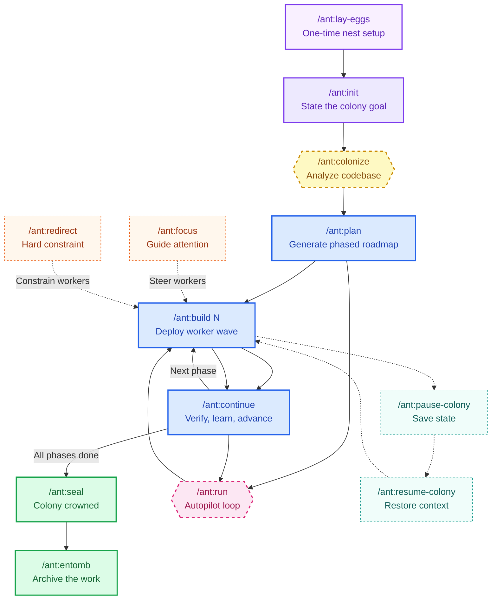

<div align="center">


# Aether

**Artificial Ecology for Thought and Emergent Reasoning**

<br>

[](https://github.com/calcosmic/Aether/releases)
[](LICENSE)
[](https://github.com/calcosmic/Aether/stargazers)
[](https://github.com/sponsors/calcosmic?utm_source=github&utm_medium=readme&utm_campaign=aether)

[](https://goreportcard.com/report/github.com/calcosmic/Aether)

[](https://pkg.go.dev/github.com/calcosmic/Aether)

<br>

*The whole is greater than the sum of its ants.*

<br>

[](https://aetherantcolony.com?utm_source=github&utm_medium=readme&utm_campaign=aether)

</div>

---

## Why Aether

Every AI coding tool now has "agents." Most of them are the same thing repackaged — a loop that plans, executes, and checks. That's not a colony. That's one ant doing laps.

Aether is different because it's modeled on how real **ant colonies** work: no central brain, no single agent trying to be everything. Instead, 24 specialized workers self-organize around your goal.

A Builder writes code. When it hits something unfamiliar, it doesn't guess — it spawns a Scout to research. When code lands, a Watcher verifies. A Tracker hunts bugs. An Archaeologist excavates git history. They work in parallel, in waves, across phases.

What makes this different:

- **Pheromone signals — not prompt engineering** — Guide workers with FOCUS, REDIRECT, and FEEDBACK. The colony adapts without rewriting prompts.
- **Memory that compounds** — Learnings from one build become instincts. Instincts promote to QUEEN.md wisdom. High-confidence wisdom flows to the Hive Brain and crosses to other projects.
- **28 skills** inject knowledge into workers.
- **Autopilot** — `/ant:run` automates the build-verify-advance loop across phases.

## Install

**Option 1: Go binary (recommended)**

```bash
go install github.com/calcosmic/Aether@latest
```

Requires [Go 1.22+](https://go.dev/dl/).

**Option 2: Download from GitHub Releases**

Pre-built binaries for all platforms — no Go toolchain needed.

| Platform | Architecture | Download |
|----------|-------------|----------|
| Linux | amd64, arm64 | [Latest release](https://github.com/calcosmic/Aether/releases?utm_source=github&utm_medium=readme&utm_campaign=aether) |
| macOS | amd64, arm64 (Apple Silicon) | [Latest release](https://github.com/calcosmic/Aether/releases?utm_source=github&utm_medium=readme&utm_campaign=aether) |
| Windows | amd64, arm64 | [Latest release](https://github.com/calcosmic/Aether/releases?utm_source=github&utm_medium=readme&utm_campaign=aether) |

Built with [GoReleaser](https://goreleaser.com).

**Option 3: Companion files (npm)**

```bash
npm install -g aether-colony
```

> **Note:** This installs companion/template files only — it does **not** include the Aether binary. Install the binary first (Option 1 or 2), then use `aether setup` to sync companion files.

### Quick start after install

```bash
aether install            # Populate the colony hub
aether setup             # Sync companion files to local repo

# Ignite the colony swarm
/ant:lay-eggs            # One-time nest setup
/ant:init "Build X"      # State the colony goal
/ant:plan                # Generate phased roadmap
/ant:build 1             # Deploy worker wave to phase one
/ant:continue            # Verify, learn, advance
/ant:seal                # Colony crowned — archive the work
```

Five commands from zero to shipped.

## Key Features

| | Feature | Description |
|---|---------|-------------|
| **Agents** | 24 Specialized Workers | Builder, Watcher, Scout, Tracker, Archaeologist, Oracle, and more |
| **Commands** | 45 Slash Commands | Full lifecycle for Claude Code and OpenCode |
| **Signals** | Pheromone System | FOCUS, REDIRECT, FEEDBACK — guide colony attention |
| **Memory** | Colony Wisdom | Learnings and instincts persist via QUEEN.md |
| **Hive Brain** | Cross-colony | Domain-scoped wisdom sharing |
| **Autopilot** | `/ant:run` | Build-verify-advance loop with smart pause |
| **Skills** | 28 Skills | 10 colony + 18 domain knowledge for workers |
| **Research** | Oracle + Scouts | Deep autonomous research before task decomposition |
| **Quality Gates** | 6-phase verification before advancing |
| **Platforms** | Claude Code + OpenCode | Binary + agent support |

### Worker Castes

| | Caste | Role |
|---|-------|------|
| 👑🐜 | **Queen** | Colony coordinator — orchestrates goals, manages phase progression, curates wisdom |
| 🔨🐜 | **Builder** | Implementation work — writes code following TDD discipline |
| 👁️🐜 | **Watcher** | Monitoring and verification — quality checks and independent testing |
| 🔍🐜 | **Scout** | Research and discovery — investigates unfamiliar territory |
| 🗺️🐜 | **Colonizer** | New project setup — explores and maps existing codebases |
| 📊🐜 | **Surveyor** | Measurement and assessment — evaluates colony health and progress |
| 🎲🐜 | **Chaos** | Edge case testing — resilience and stress testing |
| 🏺🐜 | **Archaeologist** | Git history excavation — uncovers context from commit history |
| 🔮🐜 | **Oracle** | Deep research — autonomous research via RALF loop |
| 📋🐜 | **Route Setter** | Direction setting — defines phase plans and task decomposition |
| 🔌🐜 | **Ambassador** | Third-party API integration — bridges external services |
| 👥🐜 | **Auditor** | Code review and quality audits — includes security audit duties |
| 📝🐜 | **Chronicler** | Documentation generation — produces docs, READMEs, and guides |
| 📦🐜 | **Gatekeeper** | Dependency management — handles packages, versions, and supply chain |
| ♿🐜 | **Includer** | Accessibility audits — WCAG compliance and barrier identification |
| 📚🐜 | **Keeper** | Knowledge curation — manages instincts, patterns, and wisdom |
| ⚡🐜 | **Measurer** | Performance profiling — benchmarks and optimization |
| 🧪🐜 | **Probe** | Test generation — writes and maintains test suites |
| 🐛🐜 | **Tracker** | Bug investigation — traces, hunts, and roots out bugs |
| 🔄🐜 | **Weaver** | Code refactoring — restructures and cleans codebases |
| 💭🐜 | **Dreamer** | Creative ideation — imaginative exploration and blue-sky thinking |

## Aether vs Others

| Dimension | Aether | CrewAI | AutoGen | LangGraph |
|-----------|--------|--------|---------|-----------|
| **Language** | Go | Python | Python | Python |
| **License** | MIT | MIT | MIT | Open + paid tiers |
| **Architecture** | Biological colony — 24 specialized workers self-organize via pheromone signals | Role-based agents with sequential/task delegation | Multi-agent conversation framework (Microsoft) | Graph-based state machines with conditional edges |
| **Memory / Learning** | Colony Wisdom — learnings persist as instincts, promote to QUEEN.md, share cross-colony via Hive Brain | Short-term memory + optional long-term via integration | No built-in persistent memory | Checkpoint-based state persistence |
| **Agent Coordination** | Pheromone signals (FOCUS, REDIRECT, FEEDBACK) guide attention without rewriting prompts | Hierarchical task delegation between role-assigned agents | Turn-based conversation between agents | Explicit graph edges define control flow |
| **Workers / Agents** | 24 specialized castes (Builder, Watcher, Scout, Tracker, Oracle, Archaeologist, etc.) | User-defined roles with goals and backstories | Configurable assistant and user proxy agents | Nodes as functions or LangChain runnables |
| **Commands / Control** | 45 slash commands across full lifecycle | Python SDK calls | Programmatic API | Python SDK + LangGraph Studio |
| **Autopilot** | `/ant:run` — automated build-verify-advance loop with smart pause | Sequential task execution, no built-in loop | No built-in loop | Can loop via graph cycles, not opinionated |
| **Quality Gates** | 6-phase verification before advancing phases | Optional human-in-the-loop review | No built-in gates | Manual checkpoint implementation |
| **Research** | Oracle + Scouts — autonomous deep research before task decomposition | No dedicated research agents | Group chat can approximate research | No built-in research pattern |
| **Platform Support** | Claude Code, OpenCode (binary + agent definitions) | Any Python environment | Any Python environment | Any Python environment |

## Architecture

```
.aether/                        Colony files (repo-local)
├── commands/                   45 YAML command sources
├── agents-claude/               Claude agent definitions
├── skills/                     28 skills (10 colony + 18 domain)
├── exchange/                   XML exchange modules
├── docs/                       Documentation
├── templates/                  12 templates
└── data/                       Colony state (local only)

~/.aether/                     Hub (cross-colony, user-level)
├── system/                   Companion file source (populated by install)
├── QUEEN.md                 Wisdom + preferences
├── hive/wisdom.json         Cross-colony wisdom (200 cap)
```

**Runtime:** Go 1.22+  
**Distribution:** GoReleaser (Linux, macOS, Windows / amd64 + arm64)

  
**Package:** `aether-colony` on npm (companion files only)

### Colony Lifecycle



<div align="center">
<i>Five commands from zero to shipped. Workers self-organize around your goal.</i>
</div>

## Pheromone System

Every ant colony communicates through chemical signals. Aether works the same way — you guide workers with **pheromone signals**, not by micromanaging prompts. Emit a signal before a build, and every worker in the next wave sees it.

Three signal types, three levels of control:

| Signal | Priority | Purpose | Command |
|--------|----------|---------|---------|
| **FOCUS** | normal | "Pay extra attention here" | `/ant:focus "<area>"` |
| **REDIRECT** | high | "Don't do this — hard constraint" | `/ant:redirect "<pattern to avoid>"` |
| **FEEDBACK** | low | "Adjust your approach based on this" | `/ant:feedback "<observation>"` |

Signals expire at the end of the current phase by default. Use `--ttl` for wall-clock expiration (e.g., `--ttl 2h`, `--ttl 1d`). Run `/ant:status` anytime to see active signals.

### FOCUS — Guide Attention

FOCUS tells the colony where to spend extra effort. It's like shining a spotlight on an area you care about.

```
/ant:focus "database schema -- handle migrations carefully"
/ant:focus "auth middleware correctness"
/ant:build 3
```

**Don't overdo it.** One or two FOCUS signals per phase is the sweet spot. Five signals means no signal at all.

### REDIRECT — Hard Constraints

REDIRECT is the strongest signal. Workers actively avoid the specified pattern — it's a hard constraint, not a preference.

```
/ant:redirect "Don't use jsonwebtoken -- use jose library instead"
/ant:build 2
```

**Rule of thumb:** Use REDIRECT for things that *will break* if ignored. For preferences, use FEEDBACK instead.

### FEEDBACK — Gentle Course Correction

FEEDBACK adjusts the colony's approach. It's not a command — it's an observation that influences how workers make decisions.

```
/ant:feedback "Code is too abstract -- prefer simple, direct implementations"
```

### Putting It Together

```
/ant:focus "payment flow security"
/ant:redirect "No raw SQL -- use parameterized queries only"
/ant:build 4
```

### Auto-Emitted Signals

The colony also emits signals on its own. After every phase, it produces FEEDBACK summarizing what worked and what failed. If errors recur across builds, it auto-emits REDIRECT signals. You don't manage these — they're part of the colony's self-improvement loop.

## Colony Wisdom Pipeline

Aether does not just complete tasks — it learns from them. Every build produces observations. Those observations are deduplicated, trust-scored, and promoted through a multi-stage pipeline that turns raw experience into actionable wisdom.

```
Raw observations  -->  Trust scoring  -->  Instinct store  -->  QUEEN.md  -->  Hive Brain
(anecdotal)           (0.2-1.0)         (50 cap)          (high-trust)    (cross-colony)
```

Only instincts scoring 0.80+ (trusted) or 0.90+ (canonical) are promoted to QUEEN.md. The Critic ant catches contradictions. Stale instincts are archived, not acted on.

```bash
# Read trusted instincts for worker priming
aether instinct-read-trusted --min-score 0.6

# Run full curation (normally runs at /ant:seal)
aether curation-run --verbose

# Read QUEEN.md wisdom
aether queen-read
```

## Context Continuity

Aether keeps colony context alive across `/clear`, context switches, and long conversations — without blasting full history into every prompt. It assembles a compact "context capsule" from the colony state, active pheromone signals, open flags, and the latest rolling summary.

```bash
# Generate a compact context capsule
aether context-capsule

# Resume colony after a /clear or session break
/ant:resume
```

## Autopilot Mode

`/ant:run` chains the build-verify-advance loop across multiple phases with intelligent pause conditions. Instead of running each command by hand, you engage autopilot and it handles the cycle automatically.

It pauses — not crashes — when something needs attention: test failures, critical findings, new blockers, or runtime verification. Fix the issue, run `/ant:run` again, and it resumes.

```bash
# Run all remaining phases automatically
/ant:run

# Run at most 2 phases then stop
/ant:run --max-phases 2

# Preview the plan without executing
/ant:run --dry-run

# Run without interactive prompts
/ant:run --headless
```

## Works With

- **[Claude Code](https://docs.anthropic.com/en/docs/claude-code?utm_source=github&utm_medium=readme&utm_campaign=aether)** - 45 slash commands + 24 agent definitions
- **[OpenCode](https://github.com/opencode-ai/opencode?utm_source=github&utm_medium=readme&utm_campaign=aether)** - 45 slash commands + agent definitions

## Support

If Aether has been useful to you:

**[Sponsor on GitHub](https://github.com/sponsors/calcosmic?utm_source=github&utm_medium=readme&utm_campaign=aether)**

<details>
<summary>Crypto</summary>

| Network | Address |
|---------|---------|
| **ETH** | `0xE7F8C9BE190c207D49DF01b82747cf7B6Bd1c809` |
| **SOL** | `6DVTdoZvvi9siUpgmRJZxk5Kqho8TZiN2ZzyVUVC9gX8` |

</details>

[PayPal](https://www.paypal.com/ncp/payment/RENG7ZMW5F59L?utm_source=github&utm_medium=readme&utm_campaign=aether) | [Buy Me a Coffee](https://buymeacoffee.com/music5y?utm_source=github&utm_medium=readme&utm_campaign=aether)

## License

MIT
